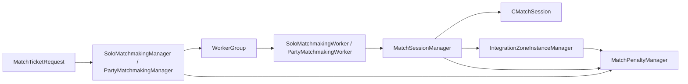

# 게임 매치메이킹 MVP 프로토타입

이 저장소는 C++ 기반 멀티플레이 매치메이킹 샘플입니다.  
핵심 관심사는 다음 세 가지입니다.

- `solo / party` 요청을 서로 다른 탐색 전략으로 처리하는 큐 구조
- `accept / place / timeout / failure / completion`으로 이어지는 세션 상태 전이
- 매치 완료 이후 `integration zone` 상태를 유지하고 정리하는 후처리 흐름

외부 서비스 연동은 단순화했지만, 매칭 로직 자체의 상태 전이와 동시성 문제는 그대로 남겨 두었습니다.

## 매칭 구조



### 1. 요청 진입 계층

- `CSoloMatchmakingManager`
  - 솔로 요청 등록, 취소, cleanup 처리
- `CPartyMatchmakingManager`
  - 파티 요청 등록, 취소, backfill 처리
- `MatchPenaltyManager`
  - 닷지 패널티 검사와 만료 관리

### 2. 큐 탐색 계층

- `CSoloMatchmakingWorkerGroup`
  - 단일 플레이어 티켓을 빠르게 묶는 단순 큐 모델
- `CPartyMatchmakingWorkerGroup`
  - 파티 크기별 버킷을 기준으로 조합 탐색
  - 동일 그룹 내부에서 집계 기반으로 후보 조합 선택
- `MatchmakingRule`
  - 목표 인원 수에 맞는 파티 조합 사전 계산

### 3. 세션 전이 계층

- `CMatchSessionManager`
  - 세션 생성, 수락 응답, 배치, 실패, 완료 처리
- `CMatchSession`
  - 세션 단위 상태와 플레이어 응답 상태 보관
- `CMatchTicket`
  - 큐 등록 이후의 런타임 티켓 상태 보관

### 4. 완료 후 상태 계층

- `CIntegrationZoneInstanceManager`
  - 배치 완료된 존 상태 등록
  - 월드/플레이어 기준 인덱싱
  - 만료 및 종료 정리 처리

## 매칭 스텝

| Step | 주요 컴포넌트 | 처리 내용 | 상태 변화 |
| --- | --- | --- | --- |
| 1 | `MatchTicketRequest` | 플레이어 또는 파티 요청 생성 | - |
| 2 | `Solo/PartyMatchmakingManager` | 이전 큐 상태 정리, integration zone 정리, 닷지 패널티 검사 | - |
| 3 | `CMatchTicket` | 요청을 런타임 티켓으로 생성하고 worker group에 등록 | `None -> QUEUED` |
| 4 | `WorkerGroup` | 월드 그룹과 존 ID 기준으로 요청 분배 | `QUEUED` |
| 5 | `Solo/PartyMatchmakingWorker` | 유효한 조합 탐색 | `QUEUED` |
| 6 | `Party/Solo WorkerGroup` | 선택된 티켓을 예약하고 큐에서 제거 | `QUEUED -> SEARCHING` |
| 7 | `CMatchSessionManager` | 매칭된 티켓 묶음을 세션으로 승격 | `SEARCHING -> REQUIRES_ACCEPTANCE` |
| 8 | `CMatchSessionManager` | 플레이어 수락/거절 반영 | `REQUIRES_ACCEPTANCE` |
| 9 | `CMatchSessionManager` | 전원 수락 시 배치 시작 | `REQUIRES_ACCEPTANCE -> PLACING` |
| 10 | `IntegrationZoneInstanceManager` | 배치 성공 시 zone 상태 등록 | `PLACING -> COMPLETED` |
| 11 | `MatchPenaltyManager` | 거절, 취소, 이탈 시 패널티 반영 | `FAILED / CANCELLED / TIMED_OUT` |

## 주요 매칭 로직

### 솔로 매칭

1. 요청이 들어오면 기존 큐 상태와 integration zone 상태를 먼저 정리합니다.
2. 패널티가 없으면 티켓을 생성하고 워커 그룹에 넣습니다.
3. 각 워커는 대기열에서 티켓을 꺼내 `m_MatchPlayerCount`가 차면 바로 세션 생성으로 넘깁니다.
4. 세션 생성 후에는 큐 소유권이 `MatchSessionManager`로 이동합니다.

### 파티 매칭

1. `MatchmakingRule`이 목표 인원 수에 맞는 파티 조합을 미리 계산합니다.
2. 파티 요청은 인원 수별 버킷에도 함께 저장됩니다.
3. 워커는 파티 크기별 queued 개수를 먼저 보고 가능한 조합이 있는지 판정합니다.
4. 유효한 조합이 있으면 각 인원 수 버킷의 앞쪽 요청으로 후보를 구성합니다.
5. 후보가 완성되면 티켓 상태를 `QUEUED -> SEARCHING`으로 전이하면서 커밋합니다.
6. 커밋에 성공한 티켓만 세션 생성 단계로 넘어갑니다.

### 세션 처리

1. `CreateMatchSession()`이 매칭된 티켓 묶음을 세션으로 등록합니다.
2. 세션은 `REQUIRES_ACCEPTANCE` 상태에서 플레이어 응답을 기다립니다.
3. 한 명이라도 거절하면 세션은 실패 처리되고, 거절 플레이어에는 닷지 패널티가 적용됩니다.
4. 전원이 수락하면 `PLACING`으로 전이하고 integration zone 배치를 진행합니다.
5. zone 등록까지 성공해야만 `COMPLETED`로 전이합니다.

## 상태 전이

```text
QUEUE
  None -> QUEUED -> SEARCHING

SESSION
  SEARCHING -> REQUIRES_ACCEPTANCE -> PLACING -> COMPLETED
                                     └-> FAILED
                                     └-> TIMED_OUT

CANCEL / CLEANUP
  QUEUED -> CANCELLED
  REQUIRES_ACCEPTANCE -> FAILED
```

## 핵심 구현 포인트

### 큐 단계와 세션 단계 분리

- 요청 등록과 취소는 `MatchmakingManager`
- 매치 후보 탐색은 `WorkerGroup`
- 수락, 배치, 완료는 `MatchSessionManager`

이렇게 나누어 큐 로직과 후속 세션 로직의 책임을 분리했습니다.

### solo / party 경로 분리

- solo는 빠른 소비가 목적
- party는 조합 탐색과 상태 커밋이 필요

탐색 비용이 다른 두 경로를 분리해 각 경로에 맞는 큐 모델을 유지했습니다.

### 조합 사전 계산

기본 `4인 매칭` 기준 대표 조합은 다음과 같습니다.

- `1 + 1 + 1 + 1`
- `2 + 2`
- `3 + 1`
- `4`

워커가 매번 정수 분할을 다시 계산하지 않도록 `MatchmakingRule`에서 조합을 사전 계산합니다.

### MMR 확장을 고려한 그룹 구조

현재 그룹 키는 `world_group + match_zone` 기준으로 구성되어 있습니다.

- 현재 구현
  - `world_group`
  - `match_zone`
- 확장 포인트
  - `mmr bucket`

즉, 현재 구조는 월드와 콘텐츠 단위로 분리되어 있고, 같은 구조에 `mmr bucket`을 추가해 MMR 기반 큐 세분화로 확장할 수 있도록 설계했습니다.

### 비동기 후처리

다음 항목은 `AsyncJobWorker`로 처리합니다.

- 수락 타임아웃
- 배치 타임아웃
- 자동 수락 데모 콜백
- 완료 데모 콜백
- 패널티 만료
- zone 만료 및 정리

### 실패 복구와 cleanup 분리

정리 과정에서 중점적으로 보완한 부분은 다음과 같습니다.

- 취소된 티켓이 worker 큐에 남지 않도록 정리
- 4인 풀파티 단일 요청도 바로 매칭되도록 수정
- cleanup 경로에서는 닷지 패널티가 적용되지 않도록 분리
- 세션 완료 실패 시 session map 누수가 남지 않도록 롤백 처리
- integration server 종료 시 잘못된 zone instance 가 정리되지 않도록 범위 제한

## 주요 파일

- `MM/matching/SoloMatchmakingManager.*`
  - 솔로 큐 등록, cleanup, 취소, dispatch
- `MM/matching/PartyMatchmakingManager.*`
  - 파티 큐 등록, 취소, backfill dispatch
- `MM/matching/workers/SoloMatchmakingWorker.*`
  - 솔로 큐 스캔과 세션 승격
- `MM/matching/workers/PartyMatchmakingWorker.*`
  - 파티 조합 탐색과 커밋
- `MM/matching/MatchSessionManager.*`
  - 세션 수명주기와 상태 전이
- `MM/matching/core/MatchmakingRule.*`
  - 룰 정의와 조합 계산
- `MM/matching/core/MatchmakingTicket.*`
  - 런타임 티켓 상태
- `MM/matching/core/MatchSession.*`
  - 런타임 세션 상태
- `MM/matching/MatchPenaltyManager.*`
  - 닷지 패널티 상태와 만료
- `MM/integration/IntegrationZoneInstanceManager.*`
  - 배치 완료 후 zone 상태 관리

## 테스트 전략

테스트는 `MM/tests/MMUnitTest.cpp`에 있습니다.

현재 테스트는 아래 범위를 검증합니다.

- 기본 solo / party 조합
- 4인 풀파티 즉시 매칭
- world group 라우팅
- 닷지 패널티와 cleanup 정책
- 로그인 / integration cleanup
- 중복 accept 방지
- 세션 완료 실패 시 롤백
- 대량 solo / party 트래픽 처리

대표 테스트 이름:

- `SoloOnePlusOnePlusOnePlusOne`
- `PartyTwoPlusTwo`
- `PartyFullGroupMatchesImmediately`
- `PartyDodgePenaltyBlocksRequeue`
- `CleanupPrevMatchmakingDoesNotApplyDodgePenalty`
- `CompleteSessionInsertFailureDoesNotLeakSession`
- `SoloHundredThousandPerformance`
- `PartyRandomPerformance`
- `PartyRandomHundredThousandPerformance`

## 성능 지표

성능 테스트는 두 가지 시점을 봅니다.

- `matchmaking latency`
  - 티켓 생성부터 세션 생성까지
- `drain time`
  - 대량 요청 이후 전체 큐가 비워질 때까지

대량 성능 시나리오는 다음과 같습니다.

- `SoloHundredThousandPerformance`
  - 1인 요청 10만 건 처리량 측정
- `PartyRandomPerformance`
  - 랜덤 파티 요청 1천 건 처리량 측정
- `PartyRandomHundredThousandPerformance`
  - 랜덤 파티 요청 10만 건 처리량 측정

출력 지표:

- `submit_ms`
- `drain_ms`
- `latency_ms[min/p50/p95/p99/max]`
- `tickets_per_sec`
- `matches_per_sec`

## 데모 전제

이 저장소는 외부 서비스 없이 흐름을 재현하기 위해 일부 데모 동작을 유지합니다.

- 자동 accept 콜백
- 자동 completion 콜백
- 단순화된 integration-server 상호작용

즉, 실행 환경은 단순화했지만 핵심 매칭 로직과 상태 전이 구조는 그대로 확인할 수 있습니다.
